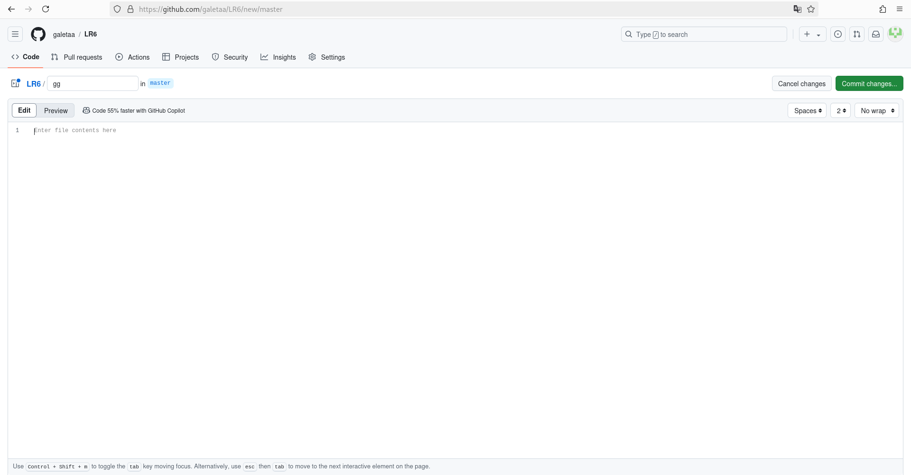
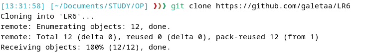
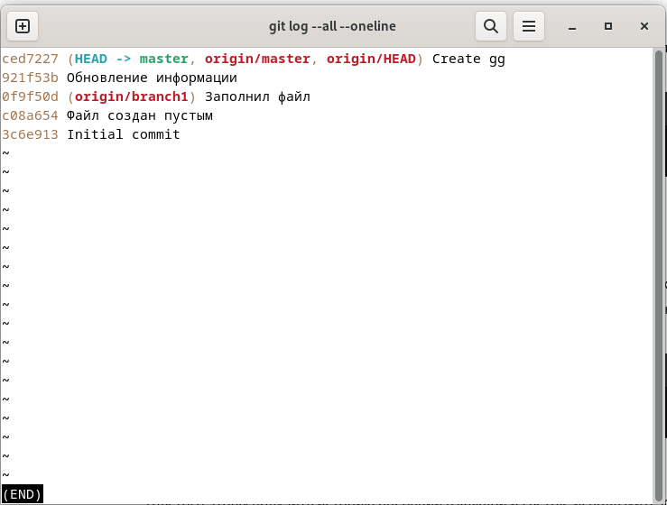
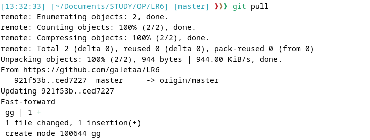
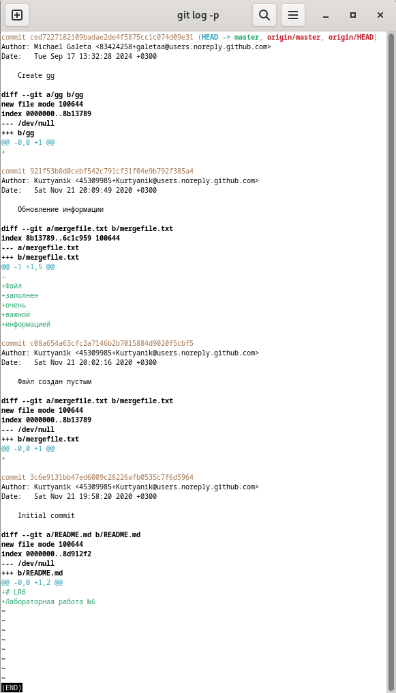
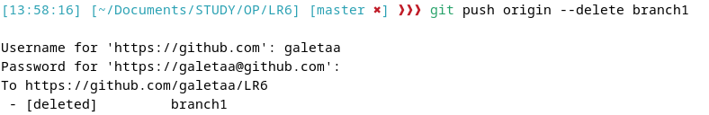
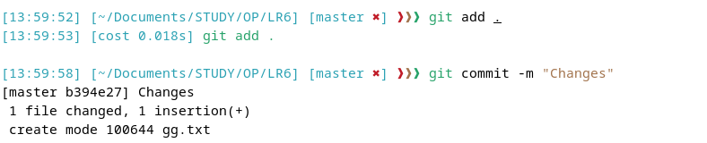
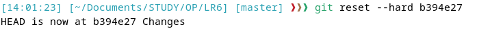
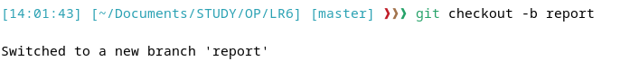

# LR6

Лабораторная работа №6

Цель лабораторной работы: изучение базовых возможностей системы управления версиями, опыт работы с Git Api, опыт работы
с локальным и удаленным репозиторием.

Ход работы:

     

Лог коммитов:
`4ecee9f 2024-09-17 4314 Галета М.А Последнее исправление отчёта
7a65161 2024-09-17 4314 Галета М.А Дополнение отчёта
a90b74e 2024-09-17 4314 Галета М.А Начало создания отчёта
b394e27 2024-09-17 4314 Галета М.А Changes
d4efad9 2024-09-17 4314 Галета М.А Merge remote-tracking branch 'origin/branch1'
ced7227 2024-09-17 Michael Galeta Create gg
921f53b 2020-11-21 Kurtyanik Обновление информации
0f9f50d 2020-11-21 Kurtyanik Заполнил файл
c08a654 2020-11-21 Kurtyanik Файл создан пустым
3c6e913 2020-11-21 Kurtyanik Initial commit`

